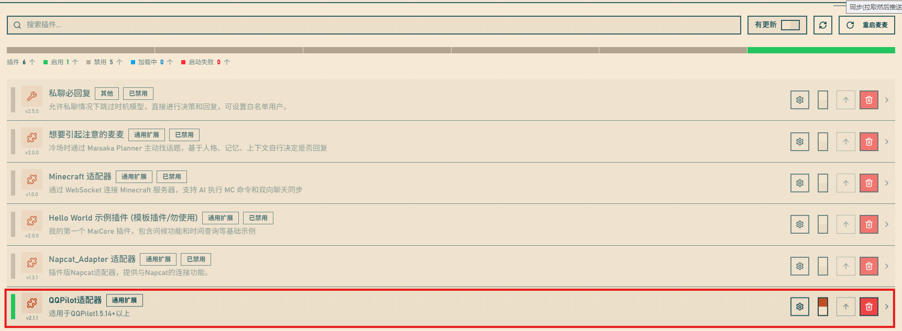
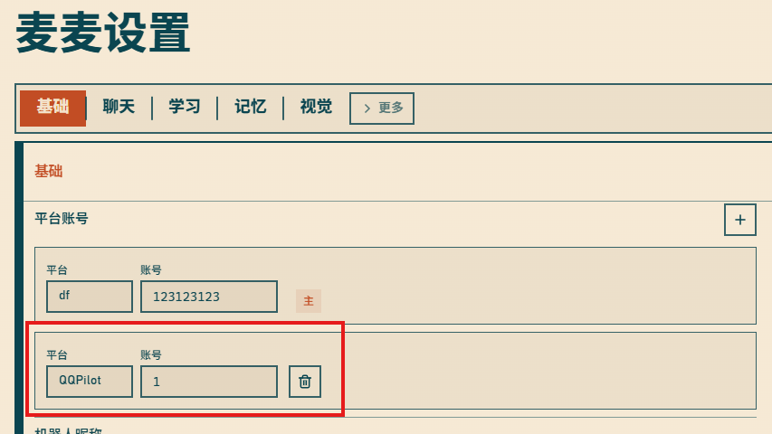
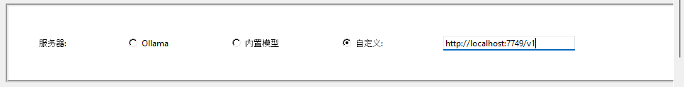
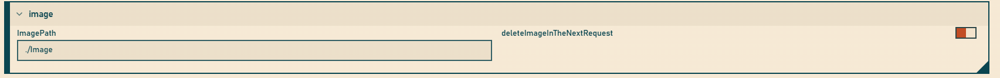

# QQPilotAdapter

 > 为QQPilot适配的[MaiBot](https://docs.mai-mai.org/)适配器

安装适配器请参考MaiBot的教程。
同时,在麦麦设置的平台中填写QQPilot,账号随意
示例:

QQPilot设置中。填写

## 发送图片
在插件管理设置中，对QQPilotAdapter

`imagePath`(从麦麦获得的表情包保存路径) 填写`<QQPilot路径>/data/Images`
`deleteImageInTheNextRequest`(下一次请求时删除上一次回复的图片)**启用**
  
## 限制
* 与主动回复类插件不兼容
* 与部分插件不兼容。

## 已知问题
可能出现插件无法启动的情况，需要重启MaiBot。

